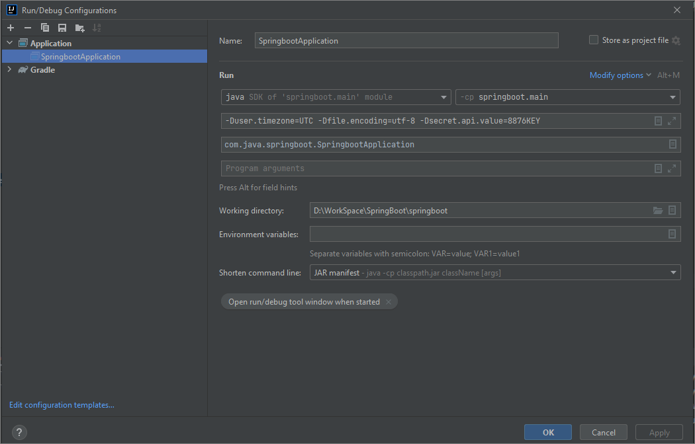

### Project Specific Documentation
This can be used as a starter project for testing out endpoints and functionalities;

Imp VM Parameters:
- -Dfile.encoding=UTF-8 ( to read sql initialization script properly )
- -Dsecret.api.value=secretValue
- -Dspring.profiles.active=local  ( windows dev )
- -Dspring.profiles.active=dev ( from unix/deployed instance )

Local endpoints active are below - all end points are not mapped here. 
This is to give the user  starting point. 
Please use the swagger for comprehensive list of endpoints.

* http://localhost:60501/swagger-ui/index.html
* http://localhost:60501/v3/api-docs
* http://localhost:60501/status
* http://localhost:60501/h2-console

---

### Logging 
The following can be used to set application/package/class level logging
```
logging.level.root=INFO
logging.level.com.java.springboot.controllers.StatusController=TRACE
```
Spring Logging Documentation :
- Standard Spring Logging Doc https://docs.spring.io/spring-boot/how-to/logging.html
- https://docs.spring.io/spring-boot/reference/features/logging.html#features.logging.custom-log-configuration
- https://logback.qos.ch/manual/appenders.html

#### Logback
- by default spring uses logback, which can be configured by logback.xml
- use `logback-spring.xml` instead of `logback.xml` as it allows spring to load custom configs
- profile specific config can be loaded with `<springProfile name="dev">`
- understanding how `maxHistory` works - https://pauldally.medium.com/why-is-my-logback-rolling-policy-keeping-more-than-maxhistory-files-66fbc865f38
- `maxHistory` changes behaviour based on policyType
- use if you want to use the default spring config in your logback along with your own config
  - `<include resource="org/springframework/boot/logging/logback/base.xml" />`
- Spring Boot Logging Documentation
  - https://docs.spring.io/spring-boot/docs/2.0.x/reference/html/boot-features-logging.html#:~:text=By%20default%2C%20Spring%20Boot%20logs,for%20example%2C%20in%20your%20application.

#### Understanding the current logback config
- for logback it will create log files in `C:\_TEMP\Logs\SpringBootLogs\CustomFileAppender\customLog.log`
- Functionalities ( Console logging, Rolling file logging, Specific java package based logging )
- Console logging is inherited from `<include resource="org/springframework/boot/logging/logback/base.xml" />`
- Additional file logging is done using `myRollingFileAppender`
- Specific package based file logging is done with `myCustomFileAppender` using `<logger>`

#### Swapping Log4j2 for Logback
- add log4j2 dependency and exclude default logging dependency 
- `implementation 'org.springframework.boot:spring-boot-starter-log4j2:3.3.4`
- `exclude group: "org.springframework.boot", module:"spring-boot-starter-logging"`
- add `logging.config=src/main/resources/log4j2-dev.xml` in `application-dev.properties`

#### Swapping logback for log4j2
- comment log4j2 dependency and remove spring logging exclude
- comment `implementation 'org.springframework.boot:spring-boot-starter-log4j2:3.3.4`
- comment`exclude group: "org.springframework.boot", module:"spring-boot-starter-logging"`
- comment `logging.config=src/main/resources/log4j2-dev.xml` in `application-dev.properties`

#### Log4j2
- `monitorInterval="10"` works, but you must update the `log4j2.xml` in `build\resources`
- console, file-based and rolling file based implementation added for log4j2 
- for envt specific log4j2 files refer - https://www.baeldung.com/spring-log4j2-config-per-profile

References :
- [logback] Understanding duplicate commons-logging issue in spring-boot - https://github.com/spring-projects/spring-framework/issues/20611
  - the same class in `commons-logging` is implemented by `spring-jcl` as a fallback in case both are present in classpath
  - `org.apache.commons.logging.LogFactory` included in `commons-logging` is given a dummy child `LogFactoryService.java`
  - this causes the message to show when it gets initialized `Standard Commons Logging discovery in action with spring-jcl`
    - `org.apache.commons.logging.LogFactory`
      - https://commons.apache.org/proper/commons-logging/apidocs/org/apache/commons/logging/LogFactory.html
      - https://github.com/spring-projects/spring-framework/blob/6.0.x/spring-jcl/src/main/java/org/apache/commons/logging/LogFactory.java
    - spring-jcl sub-class
      - https://github.com/spring-projects/spring-framework/blob/6.0.x/spring-jcl/src/main/java/org/apache/commons/logging/LogFactoryService.java
    - Problems with Apache Commons Logging ( JCL ) - https://stackoverflow.com/questions/3222895/what-is-the-issue-with-the-runtime-discovery-algorithm-of-apache-commons-logging/
    - Commons logging was my fault blog - https://radio-weblogs.com/0122027/2003/08/15.html
- [log4j2] Disadvantages of MemoryMappedAppender - https://stackoverflow.com/questions/22630547/disadvantages-of-using-memory-mapped-files


---

Env Controller
* http://localhost:60501/api/v1/envinfo
* http://localhost:60501/api/v1/envinfo/rmxbean

View endpoints are as follows
* http://localhost:60501/
* http://localhost:60501/home
* http://localhost:60501/countries
* http://localhost:60501/starter
* http://localhost:60501/starter-blank

Csv endpoints as follows ( i18n handled by jvm param )
* http://localhost:60501/api/v1/csv/file/users
* http://localhost:60501/api/v1/csv/download/users
* http://localhost:60501/api/v1/csv/read/users ( read csv file )

Upload (Multipart) and Download File
* http://localhost:60501/api/v1/csv/upload/labels?overWrite=true
* http://localhost:60501/api/v1/csv/download/labels


Json endpoints as follows : 
* http://localhost:60501/api/v1/json/file/users
* http://localhost:60501/api/v1/json/read/users

PDF Controller Using PDF Box : ( i18n achieved with dynamic font loading )
* http://localhost:60501/api/v1/pdf/file/users
* http://localhost:60501/api/v1/pdf/download/users
* http://localhost:60501/api/v1/pdf/download/password/users

Excel Controller using apache poi :
* http://localhost:60501/api/v1/excel/read/users
* http://localhost:60501/api/v1/excel/download/users
* http://localhost:60501/api/v1/excel/download/sample

XML Controller using JAXB :
* http://localhost:60501/api/v1/xml/read/users
* http://localhost:60501/api/v1/xml/file/users
* http://localhost:60501/api/v1/xml/download/users

Xpath Controller : 
* http://localhost:60501/api/v1/xpath/transform/tutorials

XSLT Controller : 
* http://localhost:60501/api/v1/xslt/transform/users
* http://localhost:60501/api/v1/xslt/transform/download/users

Protocol Buffer Controller ( save/read from disk ) :
* http://localhost:60501/api/v1/protobuf/read/users
* http://localhost:60501/api/v1/protobuf/file/users

Global Custom Error Handling Page : 
* http://localhost:60501/api/v1/countries/err
* 

Caching and Scheduling, Conditional On Property ( LabelController ) :

### TODO
* @Cacheable
* @Mockito
* Java File IO

### h2 database configuration
password is 'password'

JVM Params :
- -Duser.timezone=UTC -Dfile.encoding=utf-8

Intellij Configuration :



----
###Features 
- Internationalization added for file encodings
- save to csv locally & download

----
###References
- String Functions in Free Marker : 
  - https://freemarker.apache.org/docs/ref_builtins_string.html
- Data Types in H2 Database : 
  - https://www.h2database.com/html/datatypes.html
- Free Unicode Font
  - https://djmilch.wordpress.com/2016/01/19/free-font-noto-sans-cjk-in-ttf/
- Json Parsing Tutorials 
  - https://devqa.io/how-to-parse-json-in-java/
  - https://www.baeldung.com/guide-to-jayway-jsonpath
  - JSON Path Cheat Sheet -https://support.smartbear.com/alertsite/docs/monitors/api/endpoint/jsonpath.html
  - https://lzone.de/cheat-sheet/JSONPath
- Base64 Tutorial
  - https://www.baeldung.com/java-base64-encode-and-decode
  - URL and Filename safe Alphabet - https://www.ietf.org/rfc/rfc4648.txt
- XSLT Cheat Sheet
  - https://www.technical-recipes.com/2022/xslt-example-cheat-sheet/
  - https://www.baeldung.com/java-extensible-stylesheet-language-transformations
  - https://www.w3schools.com/xml/xsl_choose.asp
  - https://www.ibm.com/support/pages/creating-utf-8-documents-xslt
- Protocol Buffer :
  - https://www.baeldung.com/google-protocol-buffer
  - https://www.baeldung.com/spring-rest-api-with-protocol-buffers#overview
  - https://github.com/protocolbuffers/protobuf/releases
  - $ protoc --java_out=${OUTPUT_DIR} path/to/your/proto/file
    - ..\src\main>protoc --java_out=java resources\protobuf\baeldung.proto
- Global Error Handler :
  - https://stackoverflow.com/questions/63022189/get-stack-trace-from-httpservletrequest-in-spring-boot
  - https://www.baeldung.com/exception-handling-for-rest-with-spring
- Country language Codes ( en, ja, zh ) : ISO 639-1 Code
  - https://www.loc.gov/standards/iso639-2/php/code_list.php
- General Spring Related Info
  - https://stackoverflow.com/questions/21218868/explain-why-constructor-inject-is-better-than-other-options
- Cron Expressions
  - https://www.baeldung.com/cron-expressions
- SPEL Support in JPA
  - https://spring.io/blog/2014/07/15/spel-support-in-spring-data-jpa-query-definitions/
- Hibernate Logging Properties
  - https://thorben-janssen.com/hibernate-logging-guide/
- Using Environment Variables
  - https://www.baeldung.com/spring-boot-properties-env-variables
----
### Spring Boot Reference Documentation
For further reference, please consider the following sections:

* [Official Gradle documentation](https://docs.gradle.org)
* [Spring Boot Gradle Plugin Reference Guide](https://docs.spring.io/spring-boot/docs/3.2.0/gradle-plugin/reference/html/)
* [Create an OCI image](https://docs.spring.io/spring-boot/docs/3.2.0/gradle-plugin/reference/html/#build-image)
* [Spring Boot DevTools](https://docs.spring.io/spring-boot/docs/3.2.0/reference/htmlsingle/index.html#using.devtools)
* [Spring Web](https://docs.spring.io/spring-boot/docs/3.2.0/reference/htmlsingle/index.html#web)
* [Apache Freemarker](https://docs.spring.io/spring-boot/docs/3.2.0/reference/htmlsingle/index.html#web.servlet.spring-mvc.template-engines)

### Guides
The following guides illustrate how to use some features concretely:

* [Building a RESTful Web Service](https://spring.io/guides/gs/rest-service/)
* [Serving Web Content with Spring MVC](https://spring.io/guides/gs/serving-web-content/)
* [Building REST services with Spring](https://spring.io/guides/tutorials/rest/)

### Additional Links
These additional references should also help you:

* [Gradle Build Scans – insights for your project's build](https://scans.gradle.com#gradle)

